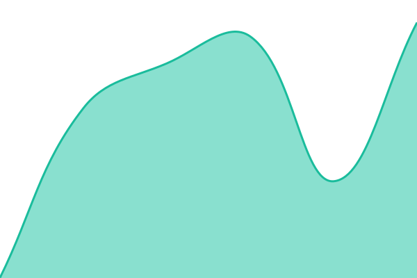
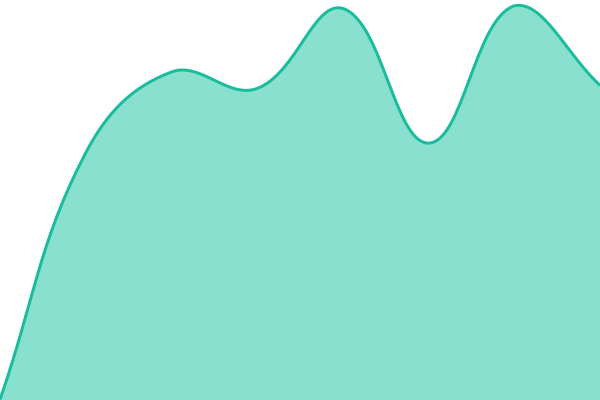
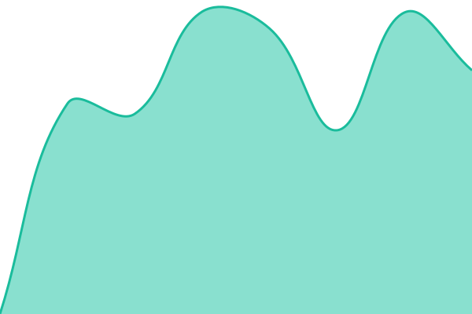

# Polymorph Status

[Upptime](https://upptime.js.org)으로 운영되는 Polymorph 서비스 상태 페이지입니다.
GitHub Actions가 5분마다 각 엔드포인트를 체크하고, 결과는 이 저장소의 git history와 GitHub Pages 상태 페이지에 자동 반영됩니다.

## 상태 페이지

- [📈 Live Status](https://polym-team.github.io/polymorph-upptime)

## 동작 원리

- `.upptimerc.yml` — 모니터링 대상 사이트 목록 (편집 대상)
- `.github/workflows/uptime.yml` — 5분마다 cron으로 사이트 체크 → `history/`에 commit
- `.github/workflows/site.yml` — 상태 페이지 빌드 후 `gh-pages` 브랜치로 배포
- `.github/workflows/summary.yml` — 이 README의 상태 표 자동 갱신
- 다운 감지 시 → GitHub Issue 자동 생성, 복구 시 자동 close

## 운영 메모

- 모니터링 대상 추가/수정은 `.upptimerc.yml`만 편집하면 됩니다. push 시 `Setup CI`가 자동으로 워크플로우/페이지를 재구성합니다.
- 워크플로우가 commit/issue를 만들려면 저장소 Settings → Actions → "Read and write permissions" 활성화 필요.
- 상태 페이지는 Settings → Pages → Source를 `gh-pages` 브랜치로 설정.

<!--start: status pages-->
<!-- This summary is generated by Upptime (https://github.com/upptime/upptime) -->
<!-- Do not edit this manually, your changes will be overwritten -->
<!-- prettier-ignore -->
| URL | 상태 | History | 응답시간 | 가동률 |
| --- | ------ | ------- | ------------- | ------ |
|  [Autto](https://autto.polymorph.co.kr) | 🟩 Up | [autto.yml](https://github.com/polym-team/polymorph-upptime/commits/HEAD/history/autto.yml) | 

 2407ms
     
 | 

<a href="https://polym-team.github.io/polymorph-upptime/history/autto">100.00%</a>
    

|  [Bookmark Share](https://bookmark-share.polymorph.co.kr) | 🟩 Up | [bookmark-share.yml](https://github.com/polym-team/polymorph-upptime/commits/HEAD/history/bookmark-share.yml) | 

 875ms
     
 | 

<a href="https://polym-team.github.io/polymorph-upptime/history/bookmark-share">100.00%</a>
    

|  [Collab](https://collab.polymorph.co.kr) | 🟩 Up | [collab.yml](https://github.com/polym-team/polymorph-upptime/commits/HEAD/history/collab.yml) | 

 791ms
     
 | 

<a href="https://polym-team.github.io/polymorph-upptime/history/collab">100.00%</a>
    

|  [Design Kit](https://design-kit.polymorph.co.kr) | 🟩 Up | [design-kit.yml](https://github.com/polym-team/polymorph-upptime/commits/HEAD/history/design-kit.yml) | 

 823ms
     
 | 

<a href="https://polym-team.github.io/polymorph-upptime/history/design-kit">100.00%</a>
    

|  [DirectFeedback](https://directfeedback.polymorph.co.kr) | 🟩 Up | [direct-feedback.yml](https://github.com/polym-team/polymorph-upptime/commits/HEAD/history/direct-feedback.yml) | 

 708ms
     
 | 

<a href="https://polym-team.github.io/polymorph-upptime/history/direct-feedback">100.00%</a>
    

|  [Jibsayo](https://jibsayo.polymorph.co.kr) | 🟩 Up | [jibsayo.yml](https://github.com/polym-team/polymorph-upptime/commits/HEAD/history/jibsayo.yml) | 

 824ms
     
 | 

<a href="https://polym-team.github.io/polymorph-upptime/history/jibsayo">100.00%</a>
    

|  [OAuth Server](https://oauth.polymorph.co.kr) | 🟩 Up | [o-auth-server.yml](https://github.com/polym-team/polymorph-upptime/commits/HEAD/history/o-auth-server.yml) | 

 632ms
     
 | 

<a href="https://polym-team.github.io/polymorph-upptime/history/o-auth-server">100.00%</a>
    

|  [Official Website](https://polymorph.co.kr) | 🟩 Up | [official-website.yml](https://github.com/polym-team/polymorph-upptime/commits/HEAD/history/official-website.yml) | 

 756ms
     
 | 

<a href="https://polym-team.github.io/polymorph-upptime/history/official-website">100.00%</a>
    

|  [Okra](https://okra.polymorph.co.kr) | 🟩 Up | [okra.yml](https://github.com/polym-team/polymorph-upptime/commits/HEAD/history/okra.yml) | 

 776ms
     
 | 

<a href="https://polym-team.github.io/polymorph-upptime/history/okra">100.00%</a>
    

|  [PolyTalk](https://polytalk.polymorph.co.kr) | 🟩 Up | [poly-talk.yml](https://github.com/polym-team/polymorph-upptime/commits/HEAD/history/poly-talk.yml) | 

 704ms
     
 | 

<a href="https://polym-team.github.io/polymorph-upptime/history/poly-talk">100.00%</a>
    

|  [Rekto](https://rekto.polymorph.co.kr) | 🟩 Up | [rekto.yml](https://github.com/polym-team/polymorph-upptime/commits/HEAD/history/rekto.yml) | 

 897ms
     
 | 

<a href="https://polym-team.github.io/polymorph-upptime/history/rekto">100.00%</a>
    

|  [Rootbeer Employee Mall](https://rootbeer-employee-mall.polymorph.co.kr) | 🟩 Up | [rootbeer-employee-mall.yml](https://github.com/polym-team/polymorph-upptime/commits/HEAD/history/rootbeer-employee-mall.yml) | 

 939ms
     
 | 

<a href="https://polym-team.github.io/polymorph-upptime/history/rootbeer-employee-mall">100.00%</a>
    

|  [Tallo](https://tallo.polymorph.co.kr) | 🟩 Up | [tallo.yml](https://github.com/polym-team/polymorph-upptime/commits/HEAD/history/tallo.yml) | 

 1860ms
     
 | 

<a href="https://polym-team.github.io/polymorph-upptime/history/tallo">100.00%</a>
    

|  [Official Website (www)](https://www.polymorph.co.kr) | 🟩 Up | [official-website-www.yml](https://github.com/polym-team/polymorph-upptime/commits/HEAD/history/official-website-www.yml) | 

 788ms
     
 | 

<a href="https://polym-team.github.io/polymorph-upptime/history/official-website-www">100.00%</a>
    

|  [ArgoCD](https://argocd.polymorph.co.kr) | 🟩 Up | [argo-cd.yml](https://github.com/polym-team/polymorph-upptime/commits/HEAD/history/argo-cd.yml) | 

 755ms
     
 | 

<a href="https://polym-team.github.io/polymorph-upptime/history/argo-cd">100.00%</a>
    

|  [Verdaccio (npm)](https://npm.polymorph.co.kr) | 🟩 Up | [verdaccio-npm.yml](https://github.com/polym-team/polymorph-upptime/commits/HEAD/history/verdaccio-npm.yml) | 

 762ms
     
 | 

<a href="https://polym-team.github.io/polymorph-upptime/history/verdaccio-npm">100.00%</a>
    

<!--end: status pages-->
